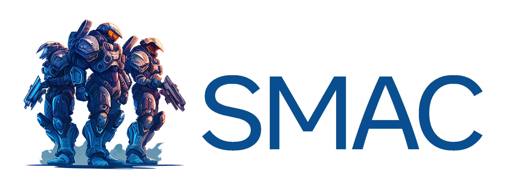

<p align="center">
 
</p>

> __Note__
> SMACv2 is out! Check it out [here](https://github.com/oxwhirl/smacv2).

> __Warning__
> **Please pay attention to the version of SC2 used for your experiments.** Performance is **not** always comparable between versions. The results in the [SMAC paper](https://arxiv.org/abs/1902.04043) use `SC2.4.6.2.69232` not `SC2.4.10`.

# SMAC - StarCraft Multi-Agent Challenge

[SMAC](https://github.com/oxwhirl/smac) is [WhiRL](http://whirl.cs.ox.ac.uk)'s environment for research in the field of collaborative multi-agent reinforcement learning (MARL) based on [Blizzard](http://blizzard.com)'s [StarCraft II](https://en.wikipedia.org/wiki/StarCraft_II:_Wings_of_Liberty) RTS game. SMAC makes use of Blizzard's [StarCraft II Machine Learning API](https://github.com/Blizzard/s2client-proto) and [DeepMind](https://deepmind.com)'s [PySC2](https://github.com/deepmind/pysc2) to provide a convenient interface for autonomous agents to interact with StarCraft II, getting observations and performing actions. Unlike the [PySC2](https://github.com/deepmind/pysc2), SMAC concentrates on *decentralised micromanagement* scenarios, where each unit of the game is controlled by an individual RL agent.

Please refer to the accompanying [paper](https://arxiv.org/abs/1902.04043) and [blogpost](https://blog.ucldark.com/2019/02/12/smac.html) for the outline of our motivation for using SMAC as a testbed for MARL research and the initial experimental results.

## About

Together with SMAC we also release [PyMARL](https://github.com/oxwhirl/pymarl) - our [PyTorch](https://github.com/pytorch/pytorch) framework for MARL research, which includes implementations of several state-of-the-art algorithms, such as [QMIX](https://arxiv.org/abs/1803.11485) and [COMA](https://arxiv.org/abs/1705.08926).

Should you have any question, please reach to [Mikayel Samvelyan](https://samvelyan.com/).

Data from the runs used in the paper is included [here](https://github.com/oxwhirl/smac/releases/download/v1/smac_run_data.json). **These runs are <ins>outdated</ins> based on recent changes in StarCraft II. If you ran your experiments using the current version of SMAC, you mustn't compare your results with the ones provided here.**

# Quick Start

## Installing SMAC

You can install SMAC by using the following command:

```shell
pip install git+https://github.com/oxwhirl/smac.git
```

Alternatively, you can clone the SMAC repository and then install `smac` with its dependencies:

```shell
git clone https://github.com/oxwhirl/smac.git
pip install -e smac/
```

*NOTE*: If you want to extend SMAC, please install the package as follows:

```shell
git clone https://github.com/oxwhirl/smac.git
cd smac
pip install -e ".[dev]"
pre-commit install
```

You may also need to upgrade pip: `pip install --upgrade pip` for the install to work.

## Installing StarCraft II

SMAC is based on the full game of StarCraft II (versions >= 3.16.1). To install the game, follow the commands bellow.

### Linux

Please use the Blizzard's [repository](https://github.com/Blizzard/s2client-proto#downloads) to download the Linux version of StarCraft II. By default, the game is expected to be in `~/StarCraftII/` directory. This can be changed by setting the environment variable `SC2PATH`.

### MacOS/Windows

Please install StarCraft II from [Battle.net](https://battle.net). The free [Starter Edition](http://battle.net/sc2/en/legacy-of-the-void/) also works. PySC2 will find the latest binary should you use the default install location. Otherwise, similar to the Linux version, you would need to set the `SC2PATH` environment variable with the correct location of the game.

## SMAC maps

SMAC is composed of many combat scenarios with pre-configured maps. Before SMAC can be used, these maps need to be downloaded into the `Maps` directory of StarCraft II.

Download the [SMAC Maps](https://github.com/oxwhirl/smac/releases/download/v0.1-beta1/SMAC_Maps.zip) and extract them to your `$SC2PATH/Maps` directory. If you installed SMAC via git, simply copy the `SMAC_Maps` directory from `smac/env/starcraft2/maps/` into `$SC2PATH/Maps` directory.

### List the maps

To see the list of SMAC maps, together with the number of ally and enemy units and episode limit, run:

```shell
python -m smac.bin.map_list 
```

### Creating new maps

Users can extend SMAC by adding new maps/scenarios. To this end, one needs to:

- Design a new map/scenario using StarCraft II Editor:
  - Please take a close look at the existing maps to understand the basics that we use (e.g. Triggers, Units, etc),
  - We make use of special RL units which never automatically start attacking the enemy. [Here](https://docs.google.com/document/d/1BfAM_AtZWBRhUiOBcMkb_uK4DAZW3CpvO79-vnEOKxA/edit?usp=sharing) is the step-by-step guide on how to create new RL units based on existing SC2 units,
- Add the map information in [smac_maps.py](https://github.com/oxwhirl/smac/blob/master/smac/env/starcraft2/maps/smac_maps.py),
- The newly designed RL units have new ids which need to be handled in [starcraft2.py](https://github.com/oxwhirl/smac/blob/master/smac/env/starcraft2/starcraft2.py). Specifically, for heterogenious maps containing more than one unit types, one needs to manually set the unit ids in the `_init_ally_unit_types()` function.

## Testing SMAC

Please run the following command to make sure that `smac` and its maps are properly installed. 

```bash
python -m smac.examples.random_agents
```

## Saving and Watching StarCraft II Replays

### Saving a replay

If you’ve using our [PyMARL](https://github.com/oxwhirl/pymarl) framework for multi-agent RL, here’s what needs to be done:
1. **Saving models**: We run experiments on *Linux* servers with `save_model = True` (also `save_model_interval` is relevant) setting so that we have training checkpoints (parameters of neural networks) saved (click [here](https://github.com/oxwhirl/pymarl#saving-and-loading-learnt-models) for more details).
2. **Loading models**: Learnt models can be loaded using the `checkpoint_path` parameter. If you run PyMARL on *MacOS* (or *Windows*) while also setting `save_replay=True`, this will save a .SC2Replay file for `test_nepisode` episodes on the test mode (no exploration) in the Replay directory of StarCraft II. (click [here](https://github.com/oxwhirl/pymarl#watching-starcraft-ii-replays) for more details).

If you want to save replays without using PyMARL, simply call the `save_replay()` function of SMAC's StarCraft2Env in your training/testing code. This will save a replay of all epsidoes since the launch of the StarCraft II client.

The easiest way to save and later watch a replay on Linux is to use [Wine](https://www.winehq.org/).

### Watching a replay

You can watch the saved replay directly within the StarCraft II client on MacOS/Windows by *clicking on the corresponding Replay file*.

You can also watch saved replays by running:

```shell
python -m pysc2.bin.play --norender --replay <path-to-replay>
```

This works for any replay as long as the map can be found by the game. 

For more information, please refer to [PySC2](https://github.com/deepmind/pysc2) documentation.

# Documentation 

For the detailed description of the environment, read the [SMAC documentation](docs/smac.md). 

The initial results of our experiments using SMAC can be found in the [accompanying paper](https://arxiv.org/abs/1902.04043).

# Citing  SMAC 

If you use SMAC in your research, please cite the [SMAC paper](https://arxiv.org/abs/1902.04043).

*M. Samvelyan, T. Rashid, C. Schroeder de Witt, G. Farquhar, N. Nardelli, T.G.J. Rudner, C.-M. Hung, P.H.S. Torr, J. Foerster, S. Whiteson. The StarCraft Multi-Agent Challenge, CoRR abs/1902.04043, 2019.*

In BibTeX format:

```tex
@article{samvelyan19smac,
  title = {{The} {StarCraft} {Multi}-{Agent} {Challenge}},
  author = {Mikayel Samvelyan and Tabish Rashid and Christian Schroeder de Witt and Gregory Farquhar and Nantas Nardelli and Tim G. J. Rudner and Chia-Man Hung and Philiph H. S. Torr and Jakob Foerster and Shimon Whiteson},
  journal = {CoRR},
  volume = {abs/1902.04043},
  year = {2019},
}
```

# Code Examples

Below is a small code example which illustrates how SMAC can be used. Here, individual agents execute random policies after receiving the observations and global state from the environment.  

If you want to try the state-of-the-art algorithms (such as [QMIX](https://arxiv.org/abs/1803.11485) and [COMA](https://arxiv.org/abs/1705.08926)) on SMAC, make use of [PyMARL](https://github.com/oxwhirl/pymarl) - our framework for MARL research.

```python
from smac.env import StarCraft2Env
import numpy as np


def main():
    env = StarCraft2Env(map_name="8m")
    env_info = env.get_env_info()

    n_actions = env_info["n_actions"]
    n_agents = env_info["n_agents"]

    n_episodes = 10

    for e in range(n_episodes):
        env.reset()
        terminated = False
        episode_reward = 0

        while not terminated:
            obs = env.get_obs()
            state = env.get_state()
            # env.render()  # Uncomment for rendering

            actions = []
            for agent_id in range(n_agents):
                avail_actions = env.get_avail_agent_actions(agent_id)
                avail_actions_ind = np.nonzero(avail_actions)[0]
                action = np.random.choice(avail_actions_ind)
                actions.append(action)

            reward, terminated, _ = env.step(actions)
            episode_reward += reward

        print("Total reward in episode {} = {}".format(e, episode_reward))

    env.close()

```

## RLlib Examples

You can also run SMAC environments in [RLlib](https://rllib.io), which includes scalable algorithms such as [PPO](https://ray.readthedocs.io/en/latest/rllib-algorithms.html#proximal-policy-optimization-ppo) and [IMPALA](https://ray.readthedocs.io/en/latest/rllib-algorithms.html#importance-weighted-actor-learner-architecture-impala). Check out the example code [here](https://github.com/oxwhirl/smac/tree/master/smac/examples/rllib).

## PettingZoo Example

Thanks to [Rodrigo de Lazcano](https://github.com/rodrigodelazcano), SMAC now supports [PettingZoo API](https://github.com/PettingZoo-Team/PettingZoo) and PyGame environment rendering. Check out the example code [here](https://github.com/oxwhirl/smac/tree/master/smac/examples/pettingzoo).

